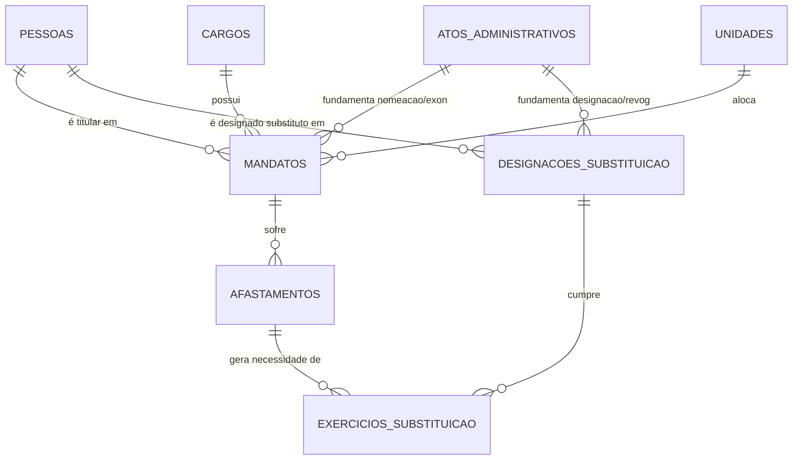

# Plano de Ação Estratégico: Módulo "Rol de Responsáveis"
*(Revisão Técnica Baseada na IN TCU 84/2020)*

Este documento detalha o planejamento arquitetural e a modelagem de dados para o módulo "Rol de Responsáveis", refletindo a natureza permanente e formal das substituições e as exigências de prestação de contas do TCU.

---

## 1. Estrutura de Titulares e Substitutos

A análise do cenário jurídico (IN TCU 84/2020) revela que a substituição não é um evento meramente reativo, mas um **vínculo permanente de responsabilidade legal**. 

- **O conceito atual de `MANDATOS` é suficiente?** Não. O modelo anterior tratava a substituição apenas como uma "troca de bastão" temporária. Isso falha ao capturar o fato de que a *condição* de substituto existe independentemente do afastamento do titular.
- **A relação Titular x Substituto deveria existir em tabela própria?** Sim. É necessário desmembrar a "Titularidade" da "Designação de Substituto", pois elas possuem ciclos de vida e atos administrativos distintos (podem começar e terminar em momentos diferentes).
- **Como representar o histórico e vigência?** Através de entidades que possuem `data_inicio`, `data_fim`, e chaves estrangeiras para o Ato Administrativo que criou/extinguiu aquela condição.

---

## 2. Modelagem Alternativa Recomendada

Para refletir a realidade administrativa e atender aos requisitos de auditoria, a modelagem ideal deve ser:

### Entidades Base
* **`PESSOAS`**: (id_pessoa, nome, cpf, email)
* **`UNIDADES`**: (id_unidade, sigla, nome, id_unidade_pai)
* **`CARGOS`**: (id_cargo, nome)

### Entidade de Atos (Nova)
* **`ATOS_ADMINISTRATIVOS`**
  - `id_ato` (PK)
  - `numero`, `ano`
  - `tipo_ato` (Portaria, Decreto, Despacho)
  - `data_publicacao`
  - `link_diario_oficial` / `arquivo_pdf`

### Entidades de Vínculo de Responsabilidade
* **`MANDATOS` (Titularidade)**
  - `id_mandato` (PK)
  - `id_pessoa` (Quem)
  - `id_cargo` + `id_unidade` (Onde/O Quê)
  - `data_inicio`, `data_fim`
  - `id_ato_nomeacao` (FK)
  - `id_ato_exoneracao` (FK)

* **`DESIGNACOES_SUBSTITUICAO` (Condição de Substituto Formal)**
  - `id_designacao` (PK)
  - `id_pessoa`
  - `id_cargo` + `id_unidade` *(Nota: O substituto é designado para o Cargo/Unidade, não para a pessoa do Titular, pois se o titular mudar, o substituto geralmente permanece até ser revogado)*
  - `ordem_substituicao` (1º Substituto, 2º Substituto - útil se houver cadeia)
  - `data_inicio`, `data_fim`
  - `id_ato_designacao` (FK)
  - `id_ato_revogacao` (FK)

### Entidades de Ocorrência (Eventos Temporários)
* **`AFASTAMENTOS`**
  - `id_afastamento` (PK)
  - `id_mandato` (Qual titular se afastou)
  - `id_motivo`
  - `data_inicio`, `data_fim`

* **`EXERCICIOS_SUBSTITUICAO` (A Ativação)**
  - `id_exercicio` (PK)
  - `id_afastamento` (Qual ausência gerou isso)
  - `id_designacao` (Qual substituto assumiu)
  - `data_inicio`, `data_fim` *(Pois o substituto pode assumir apenas parte das férias do titular, repassando para um 2º substituto depois)*

---

## 3. Ato Administrativo (Entidade Própria)

**Benefícios de isolar `ATOS_ADMINISTRATIVOS`:**
1. **Normalização Total:** Um mesmo Decreto presidencial pode nomear o Titular (Mandato) e já designar o Substituto (Designação). Armazenar o ato numa tabela própria evita digitação repetida e dados inconsistentes.
2. **Dossiê Descomplicado:** O arquivo PDF da portaria fica anexado a um único registro no banco. Qualquer entidade (Mandato ou Designação) que aponte para esse ID herda a prova documental.
3. **Auditoria:** Facilita responder à CGU/TCU: "Mostre-me todas as implicações da Portaria nº 123/2023" -> O sistema faz um JOIN reverso e lista quem foi nomeado, exonerado ou designado por ela.

---

## 4. Rol de Responsáveis para Prestação de Contas (IN TCU 84/2020)

A instrução normativa exige identificar o "período de gestão" e a "natureza da responsabilidade".

- **Quem era o responsável em determinada data?** O sistema busca o `MANDATO` vigente na data.
- **Quem era o substituto formal naquela data?** O sistema busca a `DESIGNACOES_SUBSTITUICAO` vigente na data para aquele cargo/unidade.
- **Quem exerceu efetivamente?** Verifica se a data cruza com um `AFASTAMENTO` do titular. Se sim, busca no `EXERCICIOS_SUBSTITUICAO` quem estava respondendo naquele dia específico.
- **Geração Automática do Rol:** O motor de relatórios fará varreduras anuais. Para um ano base (ex: 2024), ele lista todos os `MANDATOS` que cruzam 2024 (Natureza: Titular) e adiciona todos os `EXERCICIOS_SUBSTITUICAO` que cruzam 2024 (Natureza: Substituto no Exercício da Titularidade). Os períodos exatos (início e fim dentro do ano) são calculados dinamicamente.

---

## 5. Dossiê Funcional

A abordagem mais recomendada e robusta para o TCU e CGU é o **Modelo Híbrido centrado na Pessoa (CPF), segmentado por Mandatos**.

**Justificativa:** 
O TCU autua processos de Tomada de Contas Especial (TCE) contra o *CPF do responsável*, não contra o cargo. Portanto, ao ser auditado, o sistema deve ser capaz de emitir o **Dossiê da Pessoa**, que conterá:
- **Dados Civis:** (CPF, declarações anuais de bens consolidadas).
- **Pasta 1: Titularidade na Unidade A (2020-2022):** Contendo Ato de Nomeação, Ato de Exoneração, Relatórios de Gestão assinados.
- **Pasta 2: Designação de Substituto na Unidade B (2023-Atual):** Contendo Ato de Designação e períodos que efetivamente assumiu (Exercícios).

Isso atende à necessidade de visualizar a "vida pregressa" do gestor no órgão, algo que a CGU frequentemente avalia em trilhas de auditoria.

---

## 6. Consultas Necessárias (Exemplos Lógicos)

* **Quem era o Ministro em 31/12/2025?**
  `SELECT pessoa FROM Mandatos WHERE cargo = 'Ministro' AND '2025-12-31' BETWEEN data_inicio AND COALESCE(data_fim, CURRENT_DATE)`
* **Quem era o substituto formal do Ministro em 31/12/2025?**
  `SELECT pessoa FROM Designacoes_Substituicao WHERE cargo = 'Ministro' AND '2025-12-31' BETWEEN data_inicio AND COALESCE(data_fim, CURRENT_DATE)`
* **Quem exerceu efetivamente o cargo durante determinado afastamento?**
  `SELECT pessoa FROM Exercicios_Substituicao JOIN Designacoes_Substituicao ... WHERE id_afastamento = X`
* **Quais pessoas exerceram determinado cargo nos últimos 10 anos?**
  A query une os titulares (`MANDATOS`) e os substitutos que assumiram (`EXERCICIOS_SUBSTITUICAO`) cujo cargo seja o alvo e a data cruze o período (Ano atual - 10).
* **Qual o histórico completo de responsabilidades de uma pessoa?**
  Uma query unificada (`UNION ALL`) buscando na tabela de Mandatos (como Titular) e na de Designações (como Substituto) filtrando pelo `id_pessoa`.

---

## 7. Revisão Final e Diagrama Lógico

### Alterações em Relação ao Plano Anterior:
1. Desmembramento da atuação em **Titularidade** e **Expectativa de Substituição**.
2. Criação da tabela para isolar os **Atos Administrativos**.
3. Adição da tabela de **Exercício de Substituição**, para registrar o momento exato em que a expectativa vira responsabilidade efetiva.

### Diagrama Lógico (Entidade-Relacionamento Simplificado)

### Conclusão e Recomendação Final
A estrutura apresentada neste documento (Seção 2 e 7) é a **mais aderente possível** às exigências da IN TCU 84/2020. 

Ela resolve a complexidade de um Secretário-Executivo ser titular de sua própria pasta e substituto de um Ministro simultaneamente, preserva perfeitamente a vigência indeterminada das portarias de substituição e garante que a geração do Rol de Responsáveis para o Relatório de Gestão anual do órgão seja um processo automatizado, preciso e blindado contra inconsistências documentais.
