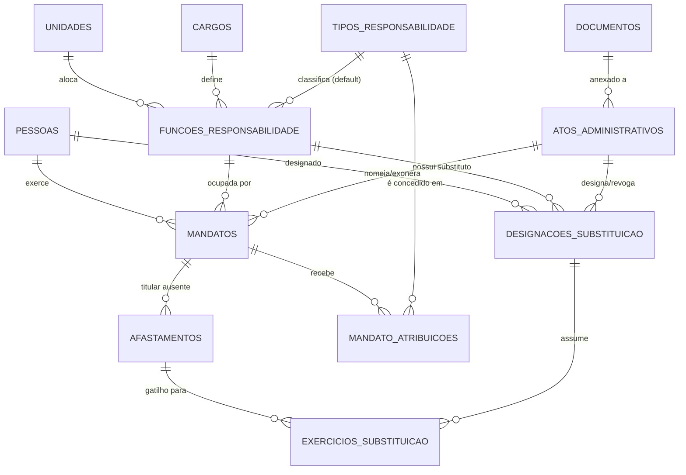

# Revisão Crítica de Arquitetura: Módulo "Rol de Responsáveis"
*(Foco em Auditoria, CGU e IN TCU 84/2020)*

Este documento apresenta uma análise profunda sobre cinco pontos arquiteturais críticos para a modelagem do sistema, visando a máxima aderência às normas de controle externo, integridade histórica e facilidade de manutenção.

---

## PONTO 1 - FUNÇÃO DE RESPONSABILIDADE (Entidade Intermediária)

### Avaliação Crítica
A criação de uma entidade intermediária (`FUNCOES_RESPONSABILIDADE` ou `CARGOS_UNIDADE`) é a diferença entre um sistema amador e um sistema corporativo de gestão estrutural. Sem ela, o sistema permitiria, por exemplo, alocar um "Ministro" na "Seção de Almoxarifado", pois a tabela de `MANDATOS` apenas cruzaria as chaves livremente.

### Vantagens e Benefícios
- **Governança:** Materializa o "Quadro de Lotação" ou "Estrutura Regimental" do órgão.
- **Prevenção de Anomalias:** Impede combinações irreais.
- **Histórico Institucional:** Se uma Diretoria for extinta, inativa-se a *Função*, mantendo o histórico de quem a ocupou intacto.

### Recomendação Final
**Aprovado e Altamente Recomendado.**
A entidade `FUNCOES_RESPONSABILIDADE` (contendo `id_funcao`, `id_cargo`, `id_unidade`, `status_ativo`) passa a ser o coração do organograma. As tabelas `MANDATOS` e `DESIGNACOES_SUBSTITUICAO` deixarão de apontar para Cargo e Unidade separadamente e apontarão apenas para `id_funcao`.

---

## PONTO 2 - TIPO DE RESPONSABILIDADE

### Avaliação Crítica
A IN TCU 84/2020 é categórica: o Rol de Responsáveis não é apenas uma lista de cargos, mas a indicação clara da **natureza da responsabilidade** (Art. 11: Dirigente Máximo, Membros de Diretoria, Ordenador de Despesas, etc.). 

### Onde a responsabilidade deve ficar?
1. **Na Pessoa?** Não, a pessoa não nasce ordenadora de despesas.
2. **No Mandato?** Quase, mas um mesmo cargo costuma carregar sempre a mesma responsabilidade por força de regimento interno (Ex: O Diretor de TI é sempre o responsável por TI).
3. **Na Função?** Sim, majoritariamente. Porém, certas responsabilidades (como Ordenação de Despesas) podem ser *delegadas* a outras funções via portaria específica.

### Recomendação Final
Criar a tabela de domínio **`TIPOS_RESPONSABILIDADE`**.
A modelagem ideal é **híbrida e flexível**:
- Adicionar o campo `id_tipo_responsabilidade_padrao` na tabela `FUNCOES_RESPONSABILIDADE`. (Ex: A função "Secretário-Executivo" já nasce com o tipo "Dirigente").
- Criar uma tabela associativa `MANDATO_ATRIBUICOES` (id, id_mandato, id_tipo_responsabilidade, id_ato_delegacao) para capturar delegações específicas que a pessoa recebeu *enquanto* estava no cargo.

---

## PONTO 3 - GESTÃO DOCUMENTAL

### Avaliação Crítica
Espalhar arquivos e hashes por várias tabelas (`ATOS_ADMINISTRATIVOS`, `PESSOAS`, `AFASTAMENTOS`) cria um pesadelo de manutenção. Como você faz backup apenas dos documentos? Como garante que nenhum arquivo foi apagado do disco se as referências estão fragmentadas?

### Recomendação Final
**Aprovado. Centralizar é imperativo.**
Criar uma tabela única **`DOCUMENTOS`** com relacionamento polimórfico ou tabela associativa.
Para máxima aderência relacional (evitando chaves polimórficas que quebram FK constraints), recomenda-se a criação da tabela `DOCUMENTOS` e tabelas associativas (`DOCUMENTO_ATO`, `DOCUMENTO_PESSOA`). 

*Facilitação do Dossiê:* Na geração do Dossiê da CGU, o sistema apenas faz um query na tabela `DOCUMENTOS` buscando todos os arquivos vinculados aos atos, mandatos e à pessoa do CPF auditado, compilando tudo em um único ZIP.

---

## PONTO 4 - TRILHA DE AUDITORIA

### Avaliação Crítica
O sistema lidará com dados de responsabilização legal. Se um usuário mal-intencionado alterar a data de fim de um mandato para livrar um gestor de um apontamento do TCU, o sistema precisa provar o crime. 

### Recomendação Final
**Manter Auditoria Centralizada (Log Table) alimentada preferencialmente por Database Triggers.**
- **Por que Triggers?** O ORM da aplicação (ex: Prisma, TypeORM, Hibernate) pode ter bugs ou um desenvolvedor pode rodar um script SQL direto no banco. Triggers no SGBD garantem que **nenhuma** alteração escape, preservando a cadeia de custódia.
- **Campos Obrigatórios:** `id_auditoria`, `nome_tabela`, `operacao` (INSERT/UPDATE/DELETE), `id_registro`, `dados_antigos` (JSONB), `dados_novos` (JSONB), `data_hora`, `usuario_id` (Injetado via session variables no banco de dados), `ip_origem`.

---

## PONTO 5 - VÍNCULO DA DESIGNAÇÃO DE SUBSTITUTO

### Avaliação Crítica
- **Alternativa A (Vinculado à Função):** O substituto é do "Diretor de RH". Se o Diretor João sai e entra a Maria, o substituto Pedro continua sendo substituto até que a portaria dele seja revogada.
- **Alternativa B (Vinculado ao Mandato):** O substituto cai automaticamente se o titular sair.
- **Alternativa C (Híbrida):** Vinculado à função, mas podendo citar o mandato.

### Recomendação Final
**A Alternativa A possui a maior aderência jurídica para uma solução de Estado.** 
A impessoalidade da Administração Pública dita que os cargos (funções) são perenes, enquanto as pessoas são transitórias. Uma portaria de substituto diz "Designo X para atuar como substituto do cargo Y". Salvo se houver revogação expressa, ele substitui a cadeira, não a pessoa. A Alternativa A garante menor risco de dados órfãos e é a recomendada.

---

## DIAGRAMA LÓGICO TEXTUAL ATUALIZADO (O Modelo Perfeito para o TCU)

## CONCLUSÃO PARA IMPLANTAÇÃO
A modelagem apresentada acima blinda o órgão contra apontamentos em auditorias. A introdução de `FUNCOES_RESPONSABILIDADE` normalizou o organograma; os `TIPOS_RESPONSABILIDADE` mapeiam diretamente para os incisos da IN TCU 84/2020; a Gestão Documental centralizada garante a montagem instantânea dos dossiês; e a Auditoria centralizada garante a integridade da prova. Este modelo está maduro para fase de desenvolvimento de DDLs e implementação física.
